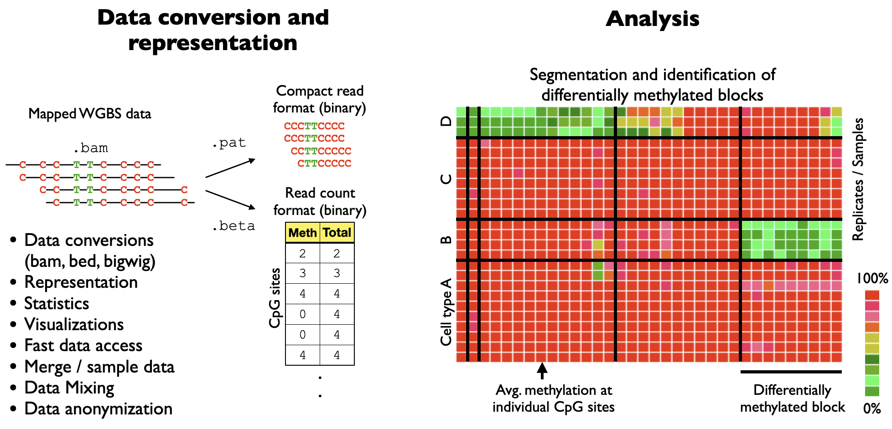
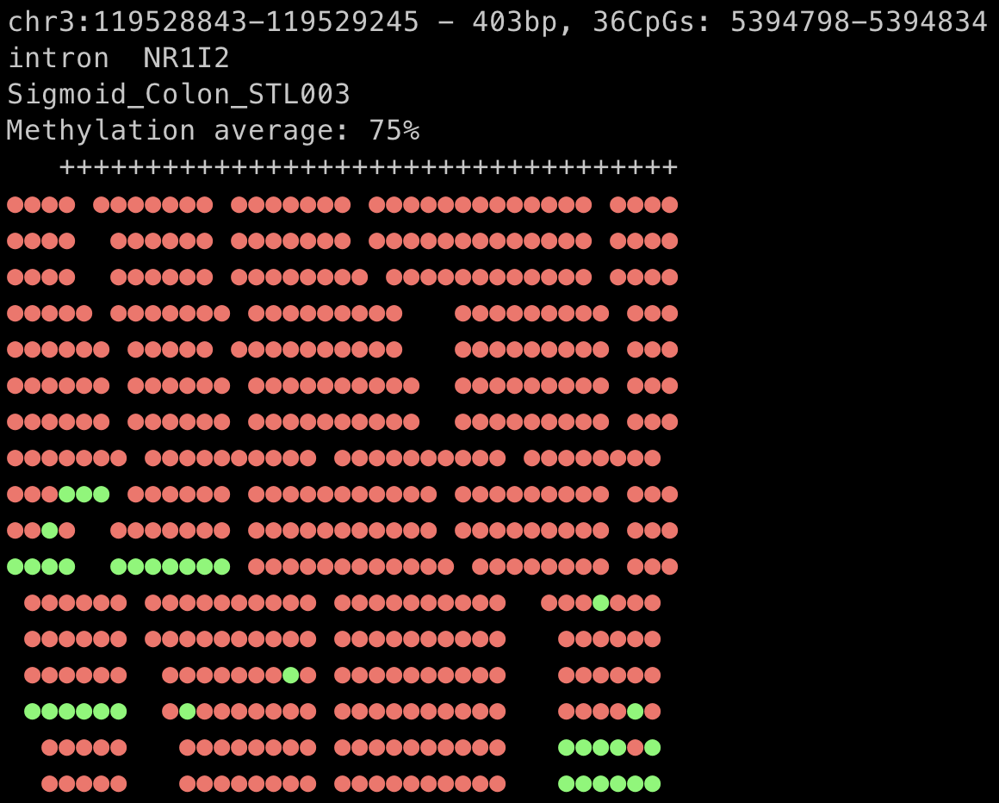
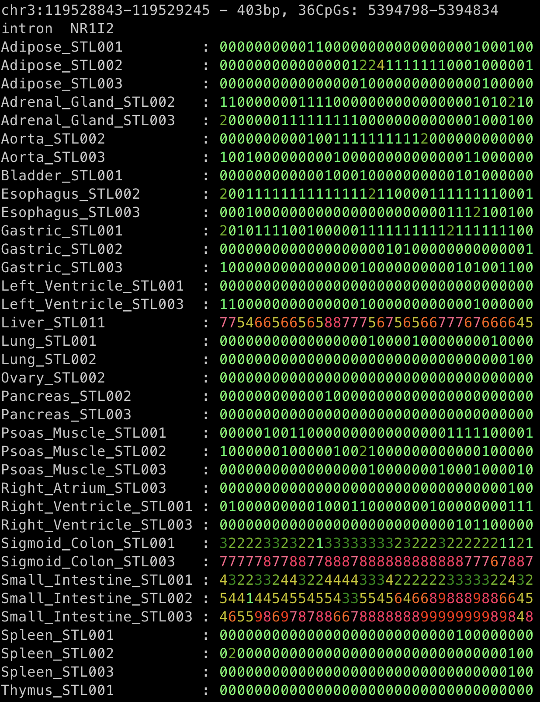

[](https://zenodo.org/badge/doi/10.5281/zenodo.8164926.svg)

# wgbstools - suite for DNA methylation sequencing data representation, visualization, and analysis
wgbstools is an extensive computational suite tailored for bisulfite sequencing data. 
It allows fast access and ultra-compact representation of high-throughput data,
as well as machine learning and statistical analysis, and informative visualizations, 
from fragment-level to locus-specific representations.

It converts data from standard formats (e.g., bam, bed) into tailored compact yet useful and intuitive formats ([pat](docs/pat_format.md), [beta](docs/beta_format.md)).
These can be visualized in terminal, or analyzed in different ways - subsample, merge, slice, mix, segment and more.


This project is developed by Netanel Loyfer and Jonathan Rosenski in [Prof. Tommy Kaplan's lab](https://www.cs.huji.ac.il/~tommy/) at the Hebrew University, Jerusalem, Israel.

## Quick start
### Installation

```bash
# Clone
git clone https://github.com/nloyfer/wgbs_tools.git
cd wgbs_tools

# compile
python setup.py
```

### Genome configuration
At least one reference genome must be configured (takes a few minutes).
```bash
wgbstools init_genome GENOME_NAME
# E.g, 
wgbstools init_genome hg19
wgbstools init_genome mm9
```
`wgbstools` downloads the requested reference FASTA file from the [UCSC website](https://hgdownload.soe.ucsc.edu/downloads.html).
If you prefer using your own reference FASTA, specify the path to the FASTA as follows.
```bash
wgbstools init_genome GENOME_NAME --fasta_path /path/to/genome.fa
```

#### Dependencies
- python 3+, with libraries:
    - pandas version 1.0+
    - numpy
    - scipy
- samtools
- tabix / bgzip
#### Dependencies for some features:
- bedtools


### Usage examples
Now you can generate `pat.gz` and `beta` files out of `bam` files:
```bash
wgbstools bam2pat Sigmoid_Colon_STL003.bam
# output:
# Sigmoid_Colon_STL003.pat.gz
# Sigmoid_Colon_STL003.beta
```

Once you have `pat` and `beta` files, you can use wgbstools to visualize them. For example:

```bash
wgbstools vis Sigmoid_Colon_STL003.pat.gz -r chr3:119528843-119529245
```
<!---->


```bash
wgbstools vis *.beta -r chr3:119528843-119529245 --heatmap
```
<!---->


### Deconvolution
To deconvolve tissues or blood samples, see our [UXM](https://github.com/nloyfer/UXM_deconv) software

### References
If you are using *wgbstools*, please cite:
<br>[Loyfer *et al.* (2024)](https://www.biorxiv.org/content/10.1101/2024.05.08.593132v1) ‘wgbstools: A computational suite for DNA methylation sequencing data representation, visualization, and analysis’, *bioRxiv* ,2024.
<br>[GEO [GSE186458](https://www.ncbi.nlm.nih.gov/geo/query/acc.cgi?acc=GSE186458) | Genome browser sessions: [hg19](https://genome-euro.ucsc.edu/s/Tomkap/Atlas_hg19) | [hg38](https://genome-euro.ucsc.edu/s/Tomkap/Atlas_hg38)]

