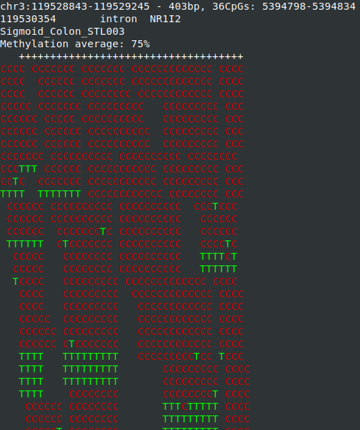
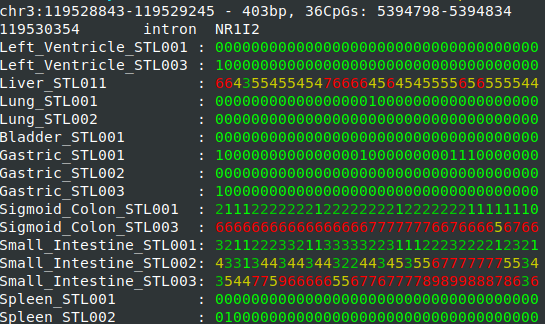

# wgbstools - suite for DNA methylation sequencing data conversion, visualization, and analysis
wgbstools is an extensive computational suite tailored for bisulfite sequencing data. 
It allows fast access and ultra-compact representation of high-throughput data and fast access,
as well as machine learning and statistical analysis, and informative visualizations, 
from fragment-level to locus-specific representations.

It converts data from standard formats (e.g., bam, bed) into tailored compact yet useful and intuitive formats ([pat](docs/pat_format.md), [beta](docs/beta_format.md)).
These can be visualized in terminal, or analyzed in different ways - subsample, merge, slice, mix, segment and more.
&ge;


#### Quick start
First make sure you have a reference genome FASTA (e.g `hg19.fa`).
The FASTA must not be compressed (gzipped).
For exapmle, download it with:

```bash
curl https://hgdownload.soe.ucsc.edu/goldenPath/hg19/bigZips/hg19.fa.gz -o hg19.fa.gz
gunzip hg19.fa.gz
```

```bash
# Download the repository
git clone https://github.com/nloyfer/wgbs_tools.git
cd wgbs_tools

# compile the cpp files:
python setup.py

# Setup reference genome GENOME_NAME (e.g hg19).
wgbstools init_genome /path/to/genome.fa GENOME_NAME
```

#### Dependencies
- samtools
- bedtools (for some features)
- python 3+


Now you can convert `pat.gz` and `beta` files out of `bam` files:
```bash
wgbstools bam2pat BAM_PATH
```

#### Usage examples
Once you have `pat` and `beta` files, you can use wgbstools to visualize them. For example:

```bash
wgbstools vis Sigmoid_Colon_STL003.pat.gz -r chr3:119528843-119529245
```


```bash
wgbstools vis *.beta -r chr3:119528843-119529245
```

