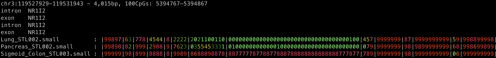
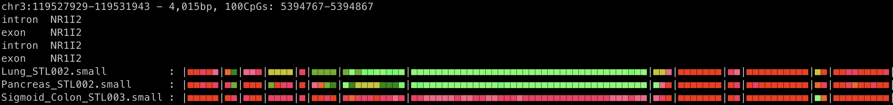
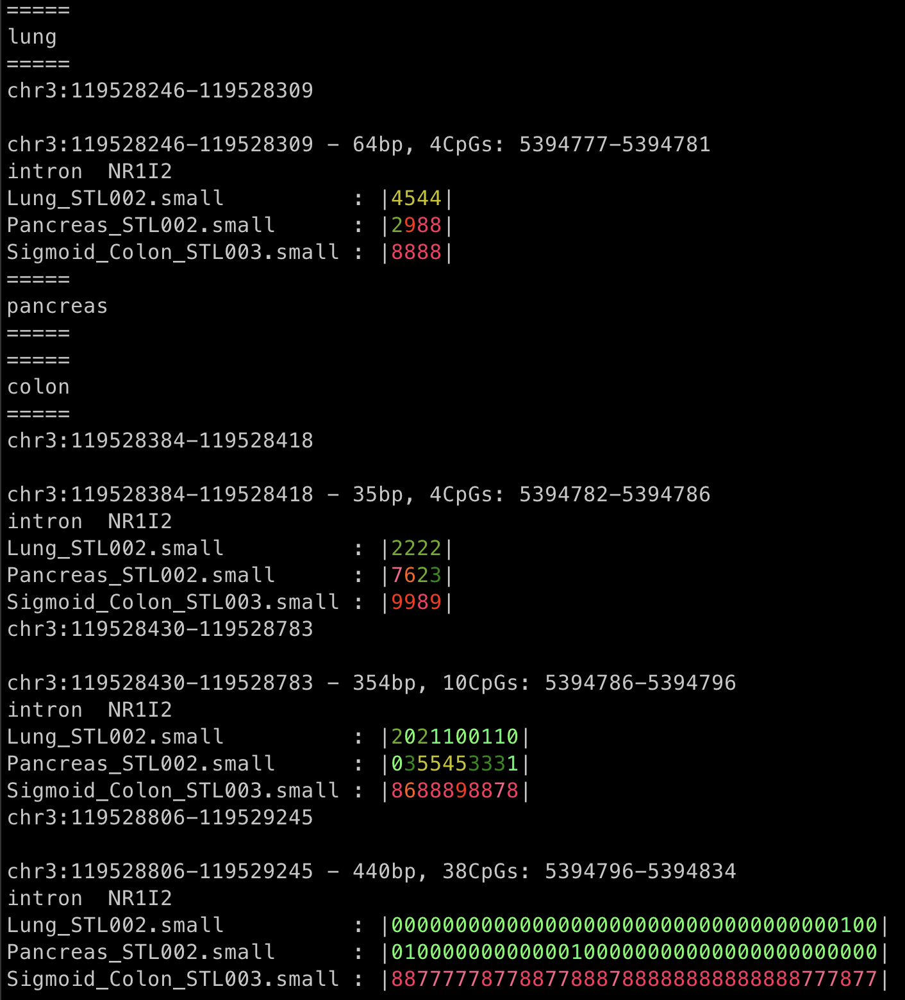
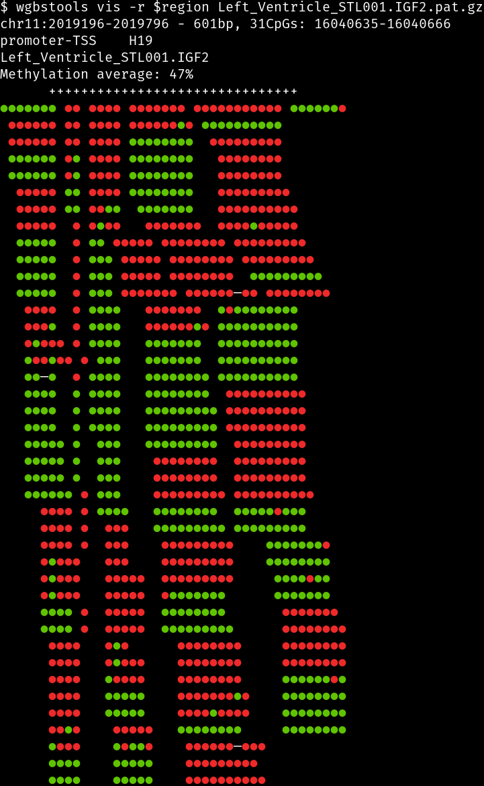
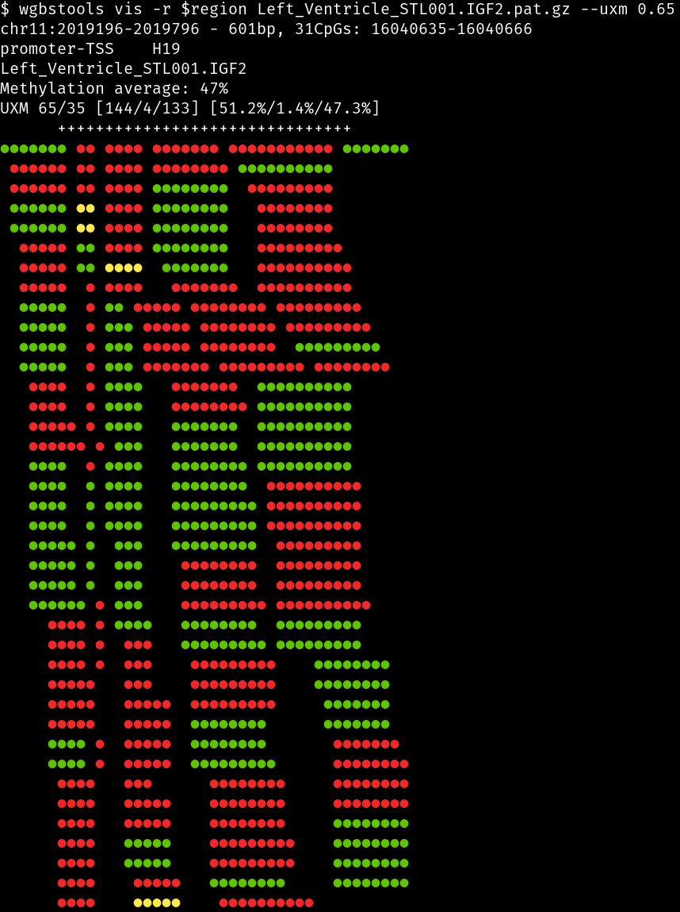
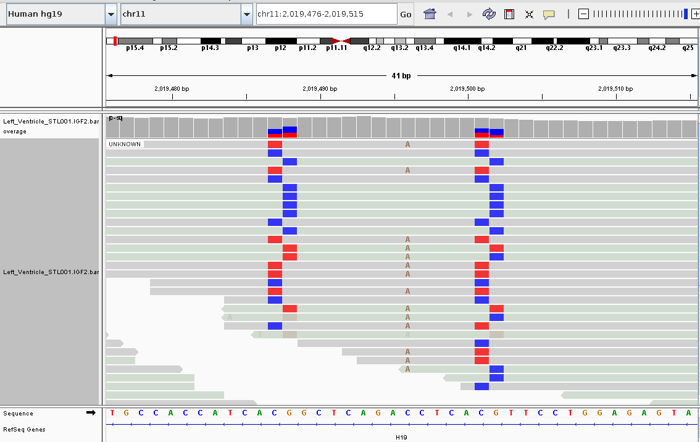
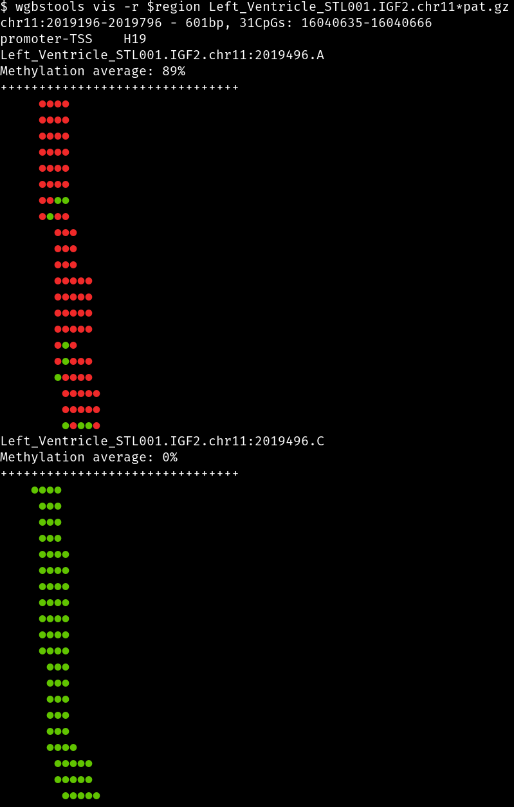

# wgbstools tutorial
## Introduction and contents
wgbstools is an extensive computational suite tailored for bisulfite sequencing data. It allows fast access, ultra-compact representation of high-throughput data, and informative visualizations, as well as machine learning and statistical analysis, from fragment-level to locus-specific representations.
In this tutorial, we'll work through the main features, including:
1. [Installation and configuration](https://github.com/rsegel/wgbs_tools/tree/master/tutorial#installation-and-configuration)
2. [Format conversion](https://github.com/rsegel/wgbs_tools/tree/master/tutorial#generate-pat--beta-files) - Generate \.pat & \.beta files from \.bam file.
3. [Segmentation](https://github.com/rsegel/wgbs_tools/tree/master/tutorial#segmentation) - Segment a given region into homogenously methylated blocks.
4. CONTINUE

## Installation and configuration
First, install `wgbstools` and [initialize](https://github.com/rsegel/wgbs_tools/blob/master/docs/init_genome_ref_wgbs.md "Alternative ref genome") `hg19` as the reference genome:
```bash
git clone https://github.com/nloyfer/wgbs_tools.git
cd wgbs_tools
python setup.py
wgbstools init_genome hg19
```

It is recommended to add wgbstools to your $PATH, E.g,
```bash
export PATH=${PATH}:$PWD
```
#### Dependencies
- python 3+, with libraries:
    - pandas version 1.0+
    - numpy
    - scipy
- samtools
- tabix / bgzip
#### Dependencies for some features:
- bedtools
- statsmodels - for test_bimodal

## All set. Let's begin
### Data and region
For this short tutorial, we will use the following publicly available samples from the [Roadmap Epigenomic Project](https://www.nature.com/articles/nature14248). The fastq files were downloaded from [GEO](https://www.ncbi.nlm.nih.gov//geo/query/acc.cgi?acc=GSE16256), mapped to hg19 using [bwa-meth](https://github.com/brentp/bwa-meth), and finally sliced to to the region `chr3:119,527,929-119,531,943`

| SRX  | Tissue  |  Donor |
|---|---|---|
| [SRX175350](https://www.ncbi.nlm.nih.gov/sra?term=SRX175350) |  Lung cells          | STL002
| [SRX388743](https://www.ncbi.nlm.nih.gov/sra?term=SRX388743) |  Pancreas cells      | STL002
| [SRX190161](https://www.ncbi.nlm.nih.gov/sra?term=SRX190161) |  Sigmoid colon cells | STL003

```bash
$ cd tutorial
$ ls -1 bams/*bam
Lung_STL002.small.bam
Pancreas_STL002.small.bam
Sigmoid_Colon_STL003.small.bam
```
### Format conversion
In many cases, we will want to consider only a small genomic region. wgbstools uses CpG indices, so we can use the `convert` command to translate genomic loci to CpG-index range and vice versa. It also prints genomic annotations, when available (currently only hg19).  
```bash
$ region=chr3:119527929-119531943
$ wgbstools convert -r $region
chr3:119527929-119531943 - 4,015bp, 100CpGs: 5394767-5394867
intron  NR1I2
exon    NR1I2
intron  NR1I2
exon    NR1I2
```

#### .pat & .bam
To generate [`.pat`](../docs/pat_format.md) and [`.beta`](../docs/beta_format.md) files for each of our samples, we use the `bam2pat` command. Notice the usage of our converted region from earlier.
```bash
$ wgbstools bam2pat bams/*.bam -r $region
[wt bam2pat] bam: bams/Lung_STL002.small.bam
[ patter ] [ chr3 ] finished 2,793 lines. 1,813 good, 980 empty, 0 invalid. (success 100%)
[wt bam2pat] bgzipping and indexing:
[wt bam2pat] generated ./Lung_STL002.small.pat.gz
[wt bam2pat] generated ./Lung_STL002.small.beta
[wt bam2pat] bam: bams/Pancreas_STL002.small.bam
[ patter ] [ chr3 ] finished 814 lines. 516 good, 298 empty, 0 invalid. (success 100%)
[wt bam2pat] bgzipping and indexing:
[wt bam2pat] generated ./Pancreas_STL002.small.pat.gz
[wt bam2pat] generated ./Pancreas_STL002.small.beta
[wt bam2pat] bam: bams/Sigmoid_Colon_STL003.small.bam
[ patter ] [ chr3 ] finished 2,986 lines. 1,989 good, 997 empty, 0 invalid. (success 100%)
[wt bam2pat] bgzipping and indexing:
[wt bam2pat] generated ./Sigmoid_Colon_STL003.small.pat.gz
[wt bam2pat] generated ./Sigmoid_Colon_STL003.small.beta

$ ls -1 *pat* *beta
Lung_STL002.small.beta
Lung_STL002.small.pat.gz
Lung_STL002.small.pat.gz.csi
Pancreas_STL002.small.beta
Pancreas_STL002.small.pat.gz
Pancreas_STL002.small.pat.gz.csi
Sigmoid_Colon_STL003.small.beta
Sigmoid_Colon_STL003.small.pat.gz
Sigmoid_Colon_STL003.small.pat.gz.csi
```
Once we have `.pat` and `.beta` files, we can use wgbstools `vis` to visualize them. For example:

```bash
wgbstools vis Sigmoid_Colon_STL003.pat.gz -r chr3:119528843-119529245
```
<!---->


```bash
wgbstools vis *.beta -r chr3:119528843-119529245 --heatmap
```
<!---->


## Segmentation 
wgbstools allows us to segment the region into homogenously methylated blocks:
```bash
$ wgbstools segment --betas *beta --min_cpg 3 --max_bp 2000 -r $region -o blocks.small.bed
[wt segment] found 9 blocks
             (dropped 8 short blocks)
$ cat blocks.small.bed
#chr    start   end     startCpG        endCpG
chr3    119527929       119528187       5394767 5394772
chr3    119528217       119528243       5394774 5394777
chr3    119528246       119528309       5394777 5394781
chr3    119528384       119528418       5394782 5394786
chr3    119528430       119528783       5394786 5394796
chr3    119528806       119529245       5394796 5394834
chr3    119529584       119530116       5394837 5394844
chr3    119530396       119530598       5394846 5394856
chr3    119531385       119531943       5394858 5394867
```
The segmentation algorithm finds a partition of the genome that optimizes some homogeneity score, i.e, the CpG sites in each block tend to have a similar methylation status. Many of the blocks are typically singletons (covering a single CpG site), but they are dropped when the `--min_cpg MIN_CPG` flag is specified.
- **TODO** phrasing - maybe something instead of "some homogenity score"

In this example, the `segment` command segmented the region chr3:119,527,929-119,531,943 to 17 blocks, 9 of them cover at least 3 CpG sites.  
The output `.bed` file has 5 columns: chr, start, end, startCpG, endCpG (non inclusive). For example, the first block is chr3:119,527,929-119,528,187, 258bp, 5 CpG sites.

**Optional**: bgzip and index the '.bed' file, make it easier to access.
`index` wraps bgzip and tabix. It compresses a `.bed` (or `.pat`) file and generates a corresponding index file. This step is necessary if you wish to visualize these blocks later using the `vis` command.
```bash
$ wgbstools index blocks.small.bed
$ ls -1 blocks.small.*
blocks.small.bed.gz
blocks.small.bed.gz.tbi
```
Having indexed our `.bed` file, we can now visalize the segmentation that we found:
```bash
$ wgbstools vis -r chr3:119527929-119531943 -b blocks.small.bed.gz *beta
```
<!---->


```bash
$ wgbstools vis -r chr3:119527929-119531943 -b blocks.small.bed.gz *beta --heatmap
```
<!---->


## Use of segmentation
⚠️ For use of wgbstools with existing `.bed` files, see [`.bed`.](https://github.com/rsegel/wgbs_tools/blob/master/docs/bed_format.md) ⚠️

### Average methylation over blocks
We can collapse the beta files and average the methylation over the blocks we found:

```zsh
$ wgbstools beta_to_table blocks.small.bed.gz --betas *beta | column -t
chr   start      end        startCpG  endCpG   Lung_STL002.small  Pancreas_STL002.small  Sigmoid_Colon_STL003.small
chr3  119527929  119528187  5394767   5394772  0.87               0.92                   0.96
chr3  119528217  119528243  5394774   5394777  0.74               1.00                   0.92
chr3  119528246  119528309  5394777   5394781  0.43               0.73                   0.80
chr3  119528384  119528418  5394782   5394786  0.21               0.45                   0.92
chr3  119528430  119528783  5394786   5394796  0.08               0.28                   0.76
chr3  119528806  119529245  5394796   5394834  0.00               0.00                   0.76
chr3  119529584  119530116  5394837   5394844  0.96               0.97                   0.96
chr3  119530396  119530598  5394846   5394856  0.94               0.91                   0.95
chr3  119531385  119531943  5394858   5394867  0.87               0.87                   0.96
```

### Differentially Methylated Regions
We can use the `wgbstools find_markers` command to find DMRs for two or more groups of samples.
This command takes as input:
- beta files: a set of beta files to find the DMR for.
- group file: a `csv` table\ text file defining which beta files are case and which are control, or other groups.
- blocks file: a [wgbstools \.bed](https://github.com/rsegel/wgbs_tools/blob/master/docs/bed_format.md ".bed format") file. Could be the output of the wgbstools `segment` command, or any custom bed file after using `convert`.

For each group defined in the `group_file`, `find_markers` will find all regions/ blocks within the supplied blocks file that differentiate between the samples within this group when compared to samples from all other groups.
Other than these required arguments, there are plenty of configuration arguments. See `find_markers --help` for more information.

We use the following group file:
```bash
$ cat bams/groups.csv
name,group
Lung_STL002.small,lung
Pancreas_STL002.small,pancreas
Sigmoid_Colon_STL003.small,colon
```
And find DMRs for the colon, the pancreas and the lung samples as follows:
```bash
$ wgbstools find_markers --blocks_path blocks.small.bed.gz --groups_file bams/groups.csv --betas *beta --delta_quants .3 --pval 1
dumped parameter file to ./params.txt
Number of markers found: 3
dumping to ./Markers.colon.bed
Number of markers found: 1
dumping to ./Markers.lung.bed
Number of markers found: 0
dumping to ./Markers.pancreas.bed
```
Here are the output markers (None found for the pancreas):
```bash
$ head Markers.*.bed

==> Markers.colon.bed <==
#chr    start   end     startCpG        endCpG  target  region  lenCpG  bp      tg_mean bg_mean delta_means     delta_quants   delta_maxmin     ttest   direction
chr3    119528405       119528431       5394784 5394787 colon   chr3:119528405-119528431        3CpGs   26bp    0.861   0.21   0.651    0.642   0.642   0.00953 M
chr3    119528639       119528783       5394789 5394796 colon   chr3:119528639-119528783        7CpGs   144bp   0.802   0.186  0.616    0.491   0.484   0.134   M
chr3    119528806       119529245       5394796 5394834 colon   chr3:119528806-119529245        38CpGs  439bp   0.757   0.006180.75     0.748   0.748   0.0019  M

==> Markers.lung.bed <==
#chr    start   end     startCpG        endCpG  target  region  lenCpG  bp      tg_mean bg_mean delta_means     delta_quants   delta_maxmin     ttest   direction
chr3    119528246       119528388       5394777 5394784 lung    chr3:119528246-119528388        7CpGs   142bp   0.428   0.774  0.346    0.3     0.298   0.0882  U

==> Markers.pancreas.bed <==
#chr    start   end     startCpG        endCpG  target  region  lenCpG  bp      tg_mean bg_mean delta_means     delta_quants   delta_maxmin     ttest   direction

```
The 10th-11th columns are the target and background methylation average for this block.
When there is more than one sample in a group, these values show the average across all samlpes in the group (e.g. for the first block, chr3:119528384-119528418, 0.21 is the average of the two "non colon" group of samples). See [`supplemental/find_markers_config.txt`](../supplemental/find_markers_config.txt) for more information.
The 12th is the difference between them (multiplied by 100). 
The `ttest` column is the p-value for a T-test. By default, DMRs with p-value>0.05 are filtered out (`--pval 0.05` flag).

Let's take a look at the markers:
```bash
for target in `tail +2 bams/groups.csv| cut -f2 -d,`; do echo "=====\n$target\n====="; for r in `cut -f7 Markers.$target.bed`; do echo "$r\n"; wgbstools vis *beta -r $r -b blocks.small.bed.gz; done ; done
```

<!---->


## Bimodal and ASM analysis

Bimodal regions are those where CpG methylation is distributed from two differently behaving sources. One common example of this, in samples with pure cell types, is allele-specific methylation (ASM). Allele specific methylation is the phenomenon whereby one allele is highly methylated and the other is lowly methylated. This occurs in sequence-dependent ASM, meQTLs, and imprinting control regions, as well as some other phenomenon. wgbstools provides tools for bimodal and ASM analysis.

We begin by creating pat files for our bam:
```bash
wgbstools bam2pat bams/Left_Ventricle_STL001.IGF2.bam
```

We then set a region and visualize it:
```bash
region=chr11:2019196-2019796
wgbstools vis -r $region Left_Ventricle_STL001.IGF2.pat.gz
```
<!---->


This region is inside of the well known ICR of IGF2. We can see that most of the reads are either mostly methylated or mostly unmethylated, or bimodal, thus suggesting allele-specific methylation.

#### Bimodal analysis

We can get counts for the amount of reads above 65% methylation, below 35% methylation, and in between, as well as visualiztion like so:

```bash
wgbstools vis -r $region Left_Ventricle_STL001.IGF2.pat.gz --uxm 0.65
```
<!---->


We can see that we have over 200 reads with 51.2% below 35% methylation,  47.3% above 65% methylation, and 1.4% with methlyation levels between 35-65%.

We can conduct a statistical test to verify that this region is indeed bimodal. We will test whether the hypothesis that all reads are generated from a single distribution is more likely than the hypothesis that there are two distinct distributions (with differing probabilities for each CpG to be methylated) from which each read is generated.

```bash
wgbstools test_bimodal -r $region Left_Ventricle_STL001.IGF2.pat.gz
LL: -1401.2486342579095 | 281 reads | 1437 observed | BPI: 0.5087178153029501
LL: -457.82607811961105 | 281 reads | 1437 observed | BPI: 0.8018590355733447
pvalue: 0.000e+00
```

We can see that the log-likelihood of the two-distribution/two-allele model is much higher than the single-allele model and the p-value is ~0.

#### ASM analysis

We now wish to verify that there is indeed allele-specific methylation. We identify a C/A heterozygous polymorphism at chr11:2019496 within our region of interest. This can be done with various tools (bisulfite SNP calling). We use the IGV to verify that there is indeed at a heterozygous polymorphism:
<!---->


To see whether there is allele-specific methylation we collect all reads which contain the C genotype into one bam/pat and all the reads which contain the A genotype into another bam/pat file:

```bash
snp=chr11:2019496
wgbstools split_by_allele bams/Left_Ventricle_STL001.IGF2.bam $snp C/A --no_beta -f
```

We then visualize the results:

```bash
wgbstools vis -r $region Left_Ventricle_STL001.IGF2.chr11:2019496*pat.gz
```
<!---->


As we can see, almost all of the reads with the A genotype are meythlated while all of the reads with the C genotype are unmethylated. 
